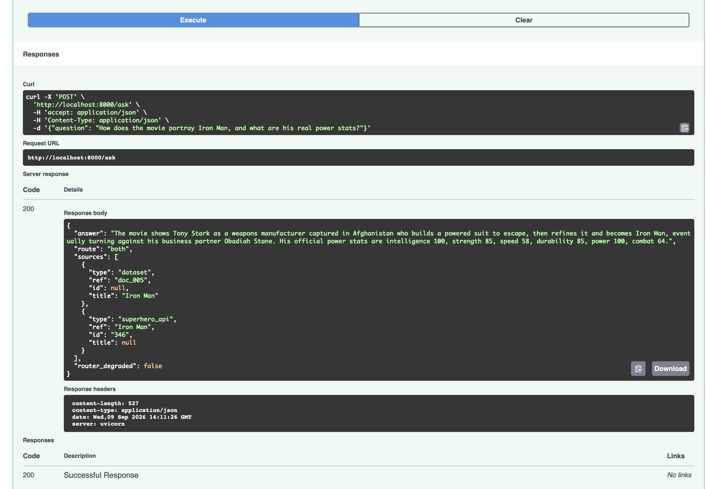
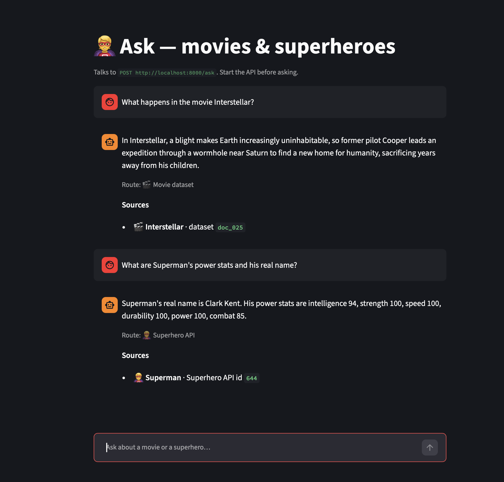
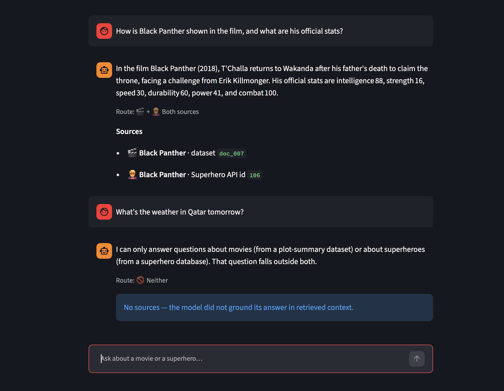

# ai-engineer-assessment-mouataz-bouazizi

A small FastAPI service with one endpoint, `POST /ask`. You send it a question in
plain English and it answers using one of two sources: a local dataset of movie
plot summaries, or the [Superhero API](https://superheroapi.com). If a question
needs both, it uses both. Every answer says where the information came from, and
the answer is built only from what was retrieved, not from the model's own memory.

Example request and response:

```bash
curl -s localhost:8000/ask -H 'content-type: application/json' \
  -d '{"question": "How does the movie portray Batman, and what are his real power stats?"}'
```

```json
{
  "answer": "...",
  "route": "both",
  "sources": [
    {"type": "dataset", "ref": "doc_001", "title": "The Dark Knight", "id": null},
    {"type": "superhero_api", "ref": "Batman", "id": "70", "title": null}
  ],
  "router_degraded": false,
  "warnings": []
}
```

`route` is `dataset`, `superhero`, `both`, or `neither`.

## Screenshots

`POST /ask` in the built-in Swagger UI. A question that needs both sources: the
answer combines a movie plot summary with live stats from the Superhero API, and
`sources` lists exactly what was used.



The Streamlit UI. A plot question goes to the dataset, a stats question goes to
the Superhero API.



The same UI showing a `both` question, and an off-topic question that the bot
declines instead of guessing.



## Setup

```bash
python3 -m venv .venv && source .venv/bin/activate
pip install -r requirements.txt
cp .env.example .env
```

Then put two free API keys in `.env`:

| Variable | Where to get it |
|---|---|
| `GROQ_API_KEY` | https://console.groq.com (sign up with an email) |
| `SUPERHERO_API_TOKEN` | https://superheroapi.com (sign in with GitHub) |

`GROQ_MODEL` defaults to `openai/gpt-oss-120b`. The models a Groq account can use
change over time; list yours with
`curl https://api.groq.com/openai/v1/models -H "Authorization: Bearer $GROQ_API_KEY"`.

## Run

```bash
./run-api.sh
```

This builds the search index and starts the server on http://localhost:8000.
Open http://localhost:8000/docs to try it in the browser, or use `curl` as shown
above.

Optional chat UI (run the API first, then this in a second terminal):

```bash
pip install -r requirements-frontend.txt
./run-ui.sh
```

## Tests

```bash
pip install -r requirements-dev.txt
pytest
```

44 tests. All network calls are mocked, so you don't need API keys to run them.

I treated these as the core logic worth testing:

- the router: a question maps to the right route and the hero name is pulled out,
  including the fallbacks when the model returns no name or the call fails
- the Superhero client: found, not found, timeout, and a broken response body
- dataset search: a known question returns the expected document
- input validation: empty, whitespace-only, and over-long questions return 422
- grounding: with no retrieved context the service refuses instead of answering,
  and `sources` only lists context that was actually used
- resilience: a source that errors is not reported as "nothing found", and a
  superhero question with no identifiable hero says so

## How it works and why

**Routing is a single LLM call.** The router asks the model for one JSON object
with the route and, if it's a superhero question, the hero's name. Doing both in
one call means a question like "what can Wonder Woman lift?" turns into
`search/wonder woman` without a second step. I set temperature to 0 so it's
repeatable, and the whole call is mocked in tests. I didn't use keyword matching
because it falls apart on rephrased questions, which is most of what the routing
needs to handle. If the LLM call fails, the router doesn't error. It falls back
to querying both sources, sets `router_degraded` in the response, and runs a
crude Title-Case scan of the question to recover a hero name, so the "both"
fallback actually queries both and not just the dataset. If a superhero route
comes back with no name at all, the question gets a direct "which superhero do
you mean?" reply instead of a vague miss.

**The dataset is ~46 movie plot summaries** (`data/movies.csv`). I picked movies
partly so the `both` route is easy to hit with a natural question, since plenty
of superhero films have both a plot and a set of stats. It isn't a contrived
"tell me about X and also Y" setup.

**Search is SQLite FTS5 with BM25 ranking.** It's in the standard library, the
ranking is predictable, and it does well on the name-heavy questions this app
gets. The tradeoff: no embeddings, so a heavily reworded plot question can miss.
I decided that wasn't worth adding an embedding provider and an index build step
for this.

**Answers are grounded.** The synthesis prompt tells the model to use only the
supplied context. If nothing was retrieved, the service returns a fixed refusal
and skips the LLM call entirely. The model also reports which context blocks it
used, and `sources` is filtered to just those, so it can't list a source it
didn't actually use.

**The Superhero API response is trimmed** before it reaches the model. The raw
payload is large and nested; I cut it down to about ten fields
(`app/superhero.py`).

**Failure handling.** Every outbound call has a timeout (5s for the Superhero
API, 20s for the LLM). On a `both` question the two lookups run at the same time.
A retriever that errors is tracked separately from one that just found nothing:
the response carries a `warnings` list, the synthesis prompt is told a source was
unavailable so it won't claim "not found", and if every retriever came back empty
the caller gets "a source was unavailable, try again" rather than a plain miss.
The only thing that returns a 503 is the final answer-generation call failing.

**Testability.** The router, the two retrievers, and the LLM client are all
behind small interfaces that get injected as FastAPI dependencies, so tests can
swap in fakes.

## What I'd add with more time

- a keyword fast path in front of the router for the obvious cases
- embedding search as a fallback when keyword search finds nothing
- caching repeated questions
- handling the case where a name search returns several heroes
